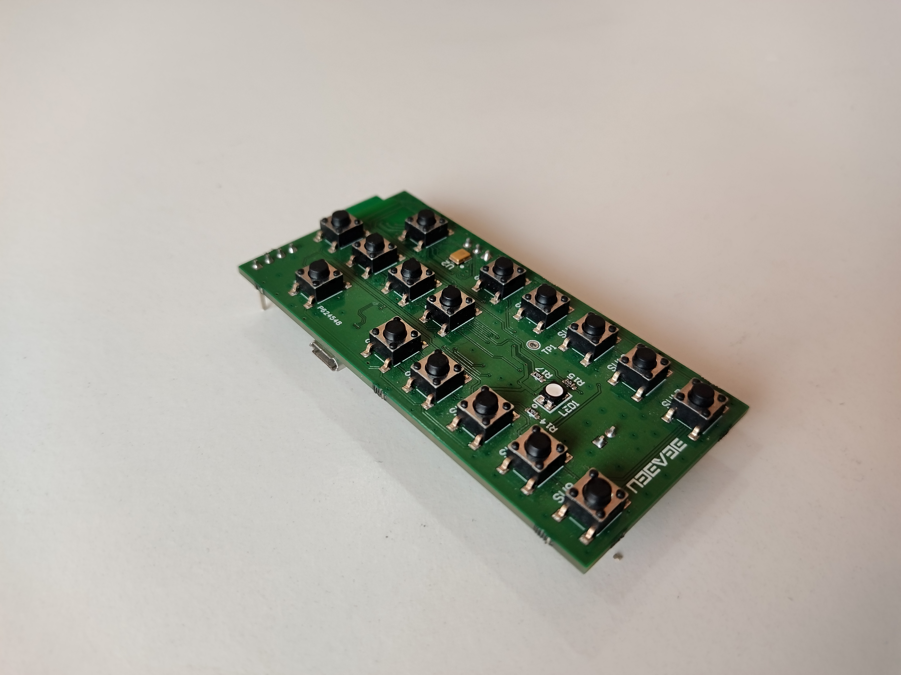
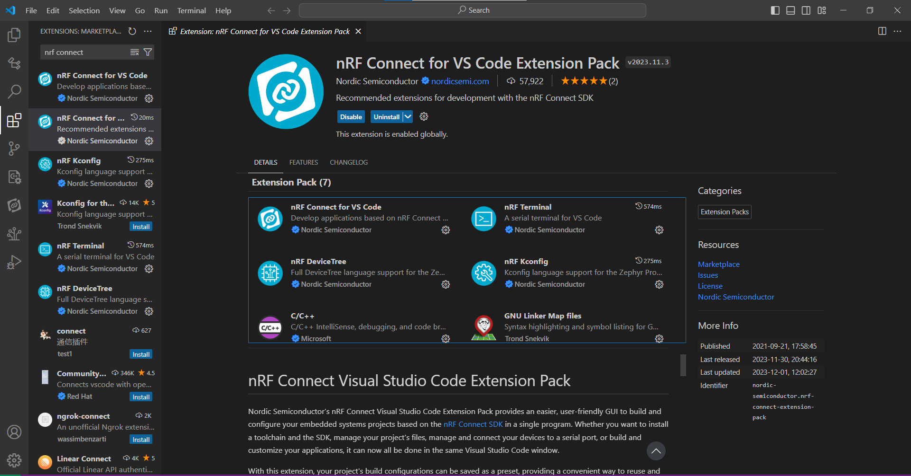
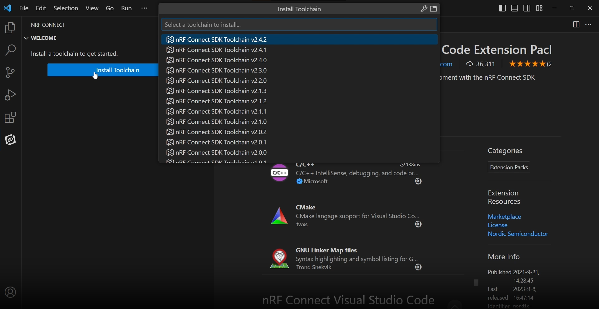
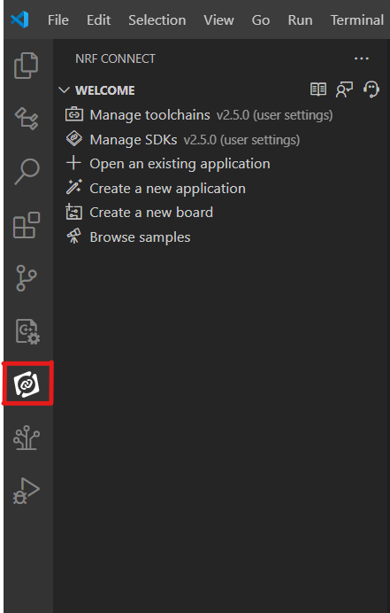
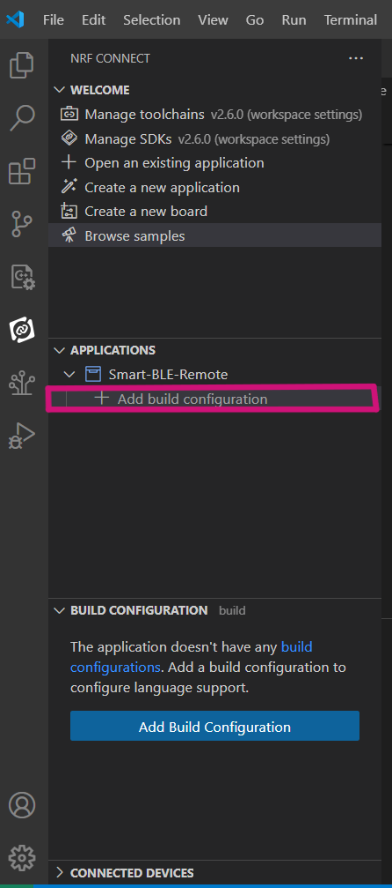
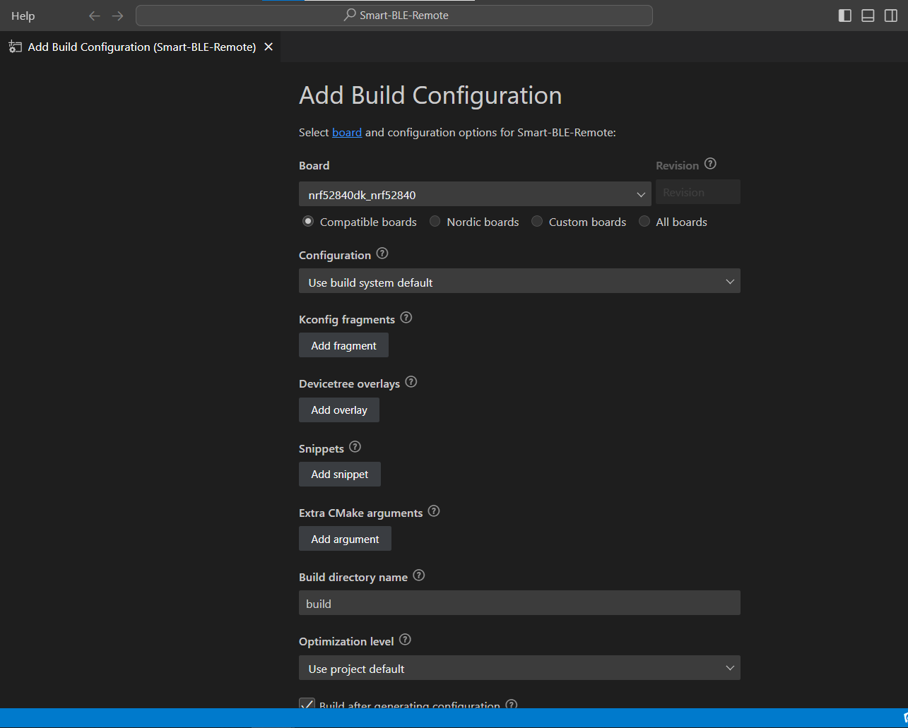
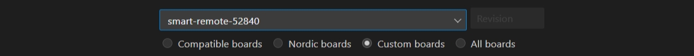
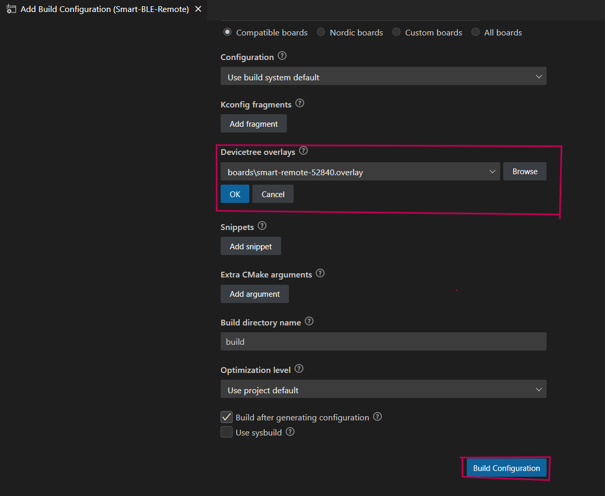
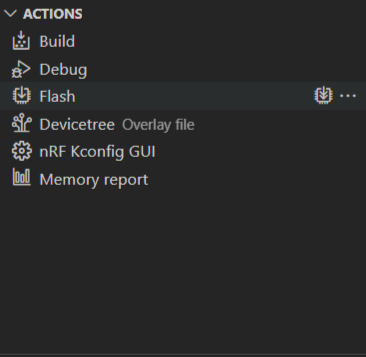

# SMART BLE REMOTE
Introducing our Smart BLE Remote Development Kit, designed to enhance your control experience with a variety of options, including keypad input, motion-based control, and voice activation.

## Software requirements​
To install the prerequisites for developing with nRF Connect for Visual Studio Code, follow these:

Go to the [nRF Connect for Desktop](https://www.nordicsemi.com/Products/Development-tools/nrf-connect-for-desktop) page and download the latest version of the nRF Connect for Desktop package for your operating system. Follow the installation instructions provided for your platform
 
Go to the [nRF Command Line Tools](https://www.nordicsemi.com/Products/Development-tools/nrf-command-line-tools) page and download the latest version of the nRF Command Line Tools package for your operating system. Follow the installation instructions provided for your platform.

Install the [Visual Studio Code](https://code.visualstudio.com/) download page and download the latest version for your operating system. Follow the installation instructions for your platform.

After installing Visual Studio Code, open it and navigate to the Extensions view by clicking on the square icon on the sidebar or by pressing Ctrl+Shift+X. Search for "nRF Connect" in the Extensions Marketplace. Look for the "nRF Connect for Visual Studio Code" extension pack and click the "Install" button.
     

#### Install Toolchain
The toolchain is a set of tools that are used together to build nRF Connect SDK applications. It includes the assembler, compiler, linker, and CMake, among other tools.

The first time you open nRF Connect for VS Code, it will prompt you to install a toolchain. This usually happens when the extension does not find any installed toolchain on your machine.

Click on Install Toolchain. It will list the available versions of toolchains that can be downloaded and installed on your machine. Select the toolchain version that matches the nRF Connect SDK version you plan to use. We recommend using the latest released tag of nRF Connect SDK. Therefore, use the latest tagged version of the toolchain, as shown in the illustration video below.

Installing the Toolchain will take some time, depending on your development platform specifications and internet speed.

## Build & flash
To get started, clone the project from GitHub using Git.
Once downloaded, launch Visual Studio Code (VSC).

In VS Code, click on the nRF Connect Extension icon. In the Welcome View, select "Open an Existing Application."

### Add a build configuration.
In the APPLICATIONS view, Hover over the application name and click on the small Add Build Configuration icon.

This will open the Add Build Configuration window shown

Change the option "Compatible Boards" to "Custom Board".
Select "smart-remote-52840" as the custom board.

Add the device tree overlay file in the board directory:
click on the build configuration to compile project

From the Actions View, click Flash to flash the application to the board. You can open the Terminal Panel to see the progress of the flashing

