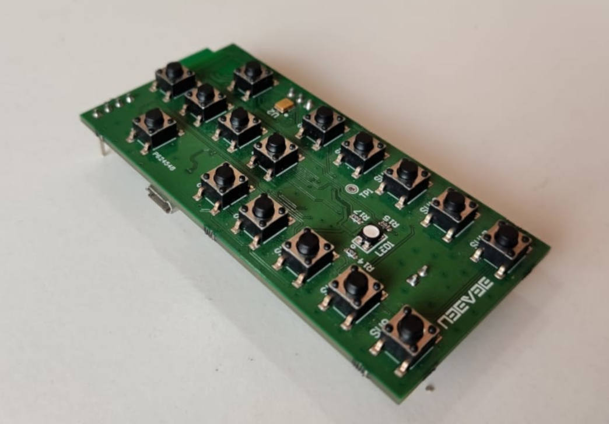

# Smart-BLE-Remote
Presenting our Smart BLE Remote Development Kit, crafted to elevate your control experience with 
versatile options including keypad input, motion-based control, and voice activation. BLE Smart Remote 
delivers an advanced control experience utilizing Smart Bluetooth Low Energy Technologies, boasting 
minimal power consumption for enhanced efficiency. With its sleek design, easy-to-use dynamic keyboard 
and accurate motion detection provided by the built-in digital accelerometer, along with effortless connectivity 
via USB power, it ensures a stable Bluetooth Low Energy (BLE) connection. Additionally, featuring a microphone for 
added functionality and a customizable RGB indicator, our Smart BLE Remote offers intuitive control for a 
wide range of applications.

This includes the following peripheral for Control applications,
 - nRF52840 Bluetooth Low Energy SoC
 - SX1508 Keypad Controller
 - FXLS8974 3-axis MEMS accelerometer
 - MP23DB01 MEMS Microphone
 - CP2102 based Serial Debug Port
 - Option to work with 2xAA battery
 
Hardware
--------

Smart BLE
---------
The BM840 module, a Full Feature BLE 5.3 module, offers dependable Bluetooth Low
Energy (BLE) connectivity suitable for diverse applications. With a 500-meter radio range,
it enables comprehensive control within the home environment.

Smart Motion
------------
Featuring the FXLS8974CF 3-Axis MEMS digital accelerometer, it fulfills motion sensing
requirements for IoT applications. This offers optimal flexibility to fulfill the resolution and
power requirements across a range of distinct use cases.

Smart Keypad
------------
Equipped with 16 dedicated keys that can be assigned to essential functions within
smart IoT control applications. Utilizing the SX1509, it incorporates a fully
programmable keypad scanning engine for seamless keypad functionality.

Smart Voice
-----------
BLE Smart Remote utilizes the MP23DB01, a digital MEMS microphone with a capacitive
sensing element, for voice-activated control applications. It also features an AI algorithm
capable of detecting human voices and acoustic waves.

Smart Power
-----------
Smart Remote featured with power optimization and it can works over the years using 2xAA battery.

Smart Debug
-----------
The debugging of smart remote applications can occur in real-time using the Serial Wire
Debug (SWD) interface, while application logs can be accessed via the serial USB to UART
bridge (CP2102).

